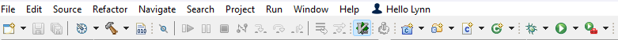
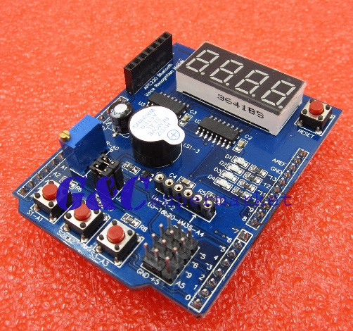
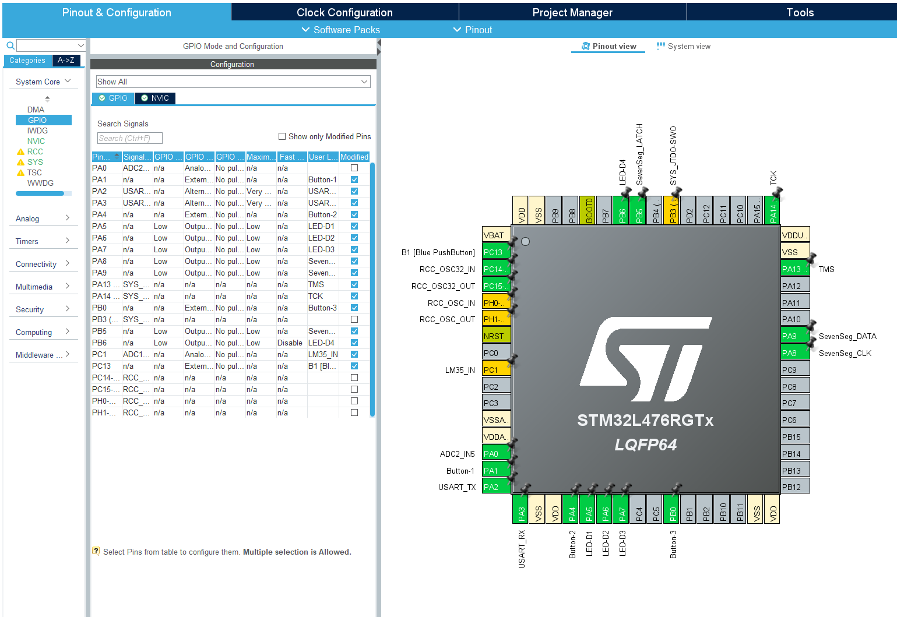

# Lab-01: STM32CubeIDE and Multi-Function Shield Introduction

## Introduction and Objective of the Lab

With the change away from the TI-MSP432 board (obsoleted) there are likely some in this class who are unfamiliar with the development environment comes with the new board to be used: STMicro’s STM32-Nucleo-F476RG. Both boards are centered on an ARM-Cortex processor and most of the fundamental principles learned in the pre-requisite ECEN-260 are unchanged.

Similarly, the integrated development environment (IDE) will necessarily change from T.I.’s Code Composer Studio, to STMicro’s customized one: STM32CubeIDE. Both of these IDEs, however, are based on the open-source Eclipse framework and the transition should be very simple.

The objectives of this first lab are as follows:

- Part 1: Install, run, and do a first example project with STMCubeIDE
- Part 2: Become familiar with some of the Hardware Abstraction Level (HAL) routines provided

For each of the parts, follow the instructions, then fill in answers to the questions. Expected answers are indicated in the boxes with red text/spaces to fill in answers.

The submission for this lab is simply this document, with your responses filled in. NO CODE needs to be submitted.

## Instructions

### Part 1: First Program with STM32CubeIDE

STM32 CubeIDE needs to be installed on your personal computer. Rather than go thru the instructions in this document, the first part of this lab is for you to replicate the steps shown in this YouTube video: [Getting Started with STM32 and Nucleo Part 1: Introduction to STM32CubeIDE and Blinky – Digi-Key - YouTube](https://www.youtube.com/watch?v=hyZS2p1tW-g&t=161s&ab_channel=DigiKey)

Note that it may be easier for you to replicate the steps in this video by following the written instructions [HERE](https://www.digikey.com/en/maker/projects/getting-started-with-stm32-introduction-to-stm32cubeide/6a6c60a670c447abb90fd0fd78008697).

When you complete the installation, and do the first “blinky” program, you should have a board that blinks the LED on/off. Experiment with the various toolbar buttons:

When completed answer the following questions. Add your answers by editing this file directly and committing it to your repository.  When completed with the lab, submit the URL to your repository as your assignment submission on Canvas.

### Part 1: Questions (5pts)

1. Platform used (PC/Mac/Linux)?
PC
2. Version of STM32CubeIDE installed?
1.14.0
3. What GPIO Pin is tied to the LED on the board?
5
4. At what frequency did your light blink?
1 Hz
5. What does the “bug” button do?
Runs the code on the microcontroller in debug mode

### Part 2: Loading/Running a pre-built project

For this part of the lab, you won’t need to write any code, but you’ll use the STM32CubeIDE to load a project already built for you, and then use that code to test out the MultiFunction add-on board. We’ll use this board for many other labs.

The MultiFunction add-on board uses an Arduino shield compatible form factor to add switches, 7-segment LED digits, a buzzer, potentiometer, and more LEDs. Documentation on the board is found in the Documentation folder for each lab.

Steps:

1. Make sure your Nucleo Board is not powered on

2. Plug in the MultiFunction board into the mating CN8 & CN9 connectors on top of the Nucleo.

3. Install the MultiFunction Example application by doing the following:
   
   1. Open STM32CubeIDE
   2. Note the directory into which you cloned the repository. Bring it into your STM32CubeIDE workspace with: File/Import/\<*your directory name*\>
   3. Plug in the board to the USB, clean/build/run the project (e.g., the bug button mentioned earlier!)

4. Experiment with the buttons, note the operation. Look at the code in :  
   Core/Src/main.c to help with the questions that follow.

5. Open the project’s configuration file GUI (ECEN-361-STM32-Lab-01-multiboard.ioc). You should see a graphical representation of the chip along with name definitions, and other parts inside the chip that have been programmed: Timers, Interrupts, etc.  
     
   Look through these definitions and compare them to the code that gets generated automatically in: 
   
   * main.c, (main execution loop)
   
   * stm32l4xx_it.c (interrupt handlers and config)
   
   * stm32l4xx_hal_msp.c (hardware abstraction layer)

### Part 2: Questions (5pts)

1. What does switch 1 (S1) do?
SW1 reverses the order in which the counter proceeds.
2. What does switch 2 (S2) do?
SW2 toggles D1.
3. What does switch 3 (S3) do?
SW3 doesn't seem to do anything.
4. What variable would you change to make the first number shown on the 7-segment digits be ‘1234’?
"Seven_Seg_Count"
5. What pin on the chip is tied to the potentiometer?
PA0
## Extra-Credit Opportunities (5pts for any of the following)

* In addition to the changing digits, there is a serial output terminal stream that is reporting status abut every second or so.  Connect a terminal emulator to this stream (Windows: 'PuTTY' or 'Tera Term', Mac: 'screen') and paste a line from its output.

* What does the potentiometer do in the program
